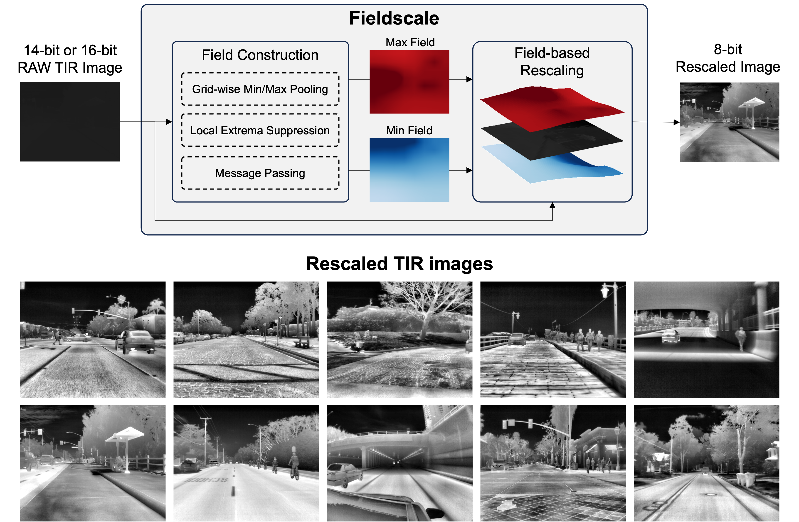
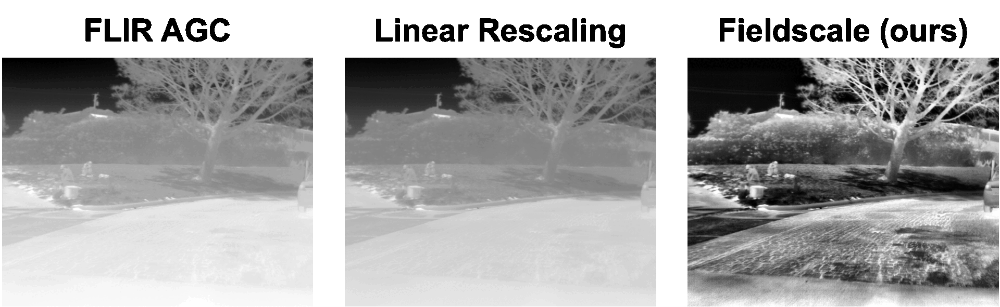

<div align="center">
<h2>Fieldscale: Locality-Aware Field-based Adaptive Rescaling for Thermal Infrared Image</h2>

[**Hyeonjae Gil**](https://hyeonjaegil.github.io/)<sup>1</sup> · [**Myung-Hwan Jeon**](https://myunghwanjeon.github.io/)<sup>1</sup> · [**Ayoung Kim**](https://ayoungk.github.io/)<sup>1*</sup>

<sup>1</sup>Seoul National University

**RA-L 2024 (and ICRA 2025)**

[[`Paper`](https://arxiv.org/abs/2405.15395)] [[`Supplementary Video`](https://youtu.be/xe7sFsw655c?feature=shared)] [[`BibTex`](#citing-fieldscale)]

<br>
</div>

## What is Fieldscale?
Fieldscale is a TIR image rescaling method that adaptively rescales TIR images by considering both the intensity value and spatial context of each pixel. Output TIR images exhibit **enhanced image quality** and strong usability for downstream tasks such as **object detection** and **place recognition**.

## How does it work?
<div align="center">
 
</div>

Fieldscale constructs two 2D scalar fields, the <span style="color:blue">*min field*</span> and the <span style="color:red">*max field*</span>, to encode the local intensity range of each pixel. The fields are then used to ***adaptively*** rescale the input image. Although Fieldscale is designed for **TIR images**, it can also be applied to the **videos**.

## Comparison with Existing Methods
<div align="center">

</div>

Fieldscale effectively rescales TIR images while preserving the local details and enhancing the global consistency. We note that *FLIR AGC* is only provided by the FLIR thermal camera manufacturer and Fieldscale can be **a general-purpose method** for various TIR cameras.

## How to use
Fieldscale is currently implemented in both Python and C++ (thanks to [seungsang07](https://github.com/seungsang07)). 
Please refer to the [python](./python/) or [cpp](./cpp/) directories for more details.

## News
- **2025-04-28:** Fieldscale now supports both python and C++.
- **2025-01-28:** Fieldscale will be presented at the IEEE International Conference on Robotics and Automation (ICRA) 2025.
- **2024-06-07:** All code are now available on GitHub.
- **2024-05-17:** Fieldscale has been accepted to IEEE Robotics and Automation Letters (RA-L)!

## Citing Fieldscale

If you find this repository useful, please consider giving a star :star: and citing:

```
@article{gil2024fieldscale,
  title={Fieldscale: Locality-Aware Field-based Adaptive Rescaling for Thermal Infrared Image},
  author={Gil, Hyeonjae and Jeon, Myung-Hwan and Kim, Ayoung},
  journal={IEEE Robotics and Automation Letters},
  year={2024},
  publisher={IEEE}
}
```
