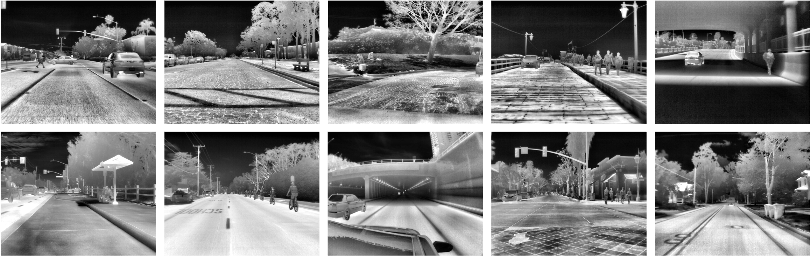
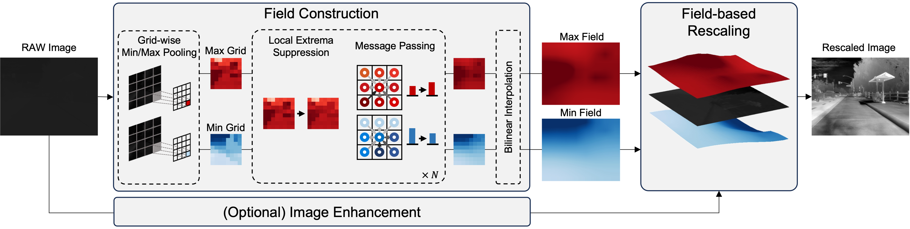

<div align="center">
<h2>Fieldscale: Locality-Aware Field-based Adaptive Rescaling for Thermal Infrared Image</h2>

[**Hyeonjae Gil**](https://hyeonjaegil.github.io/)<sup>1</sup> · [**Myeong-Hwan Jeon**](https://myunghwanjeon.github.io/)<sup>1</sup> · [**Ayoung Kim**](https://ayoungk.github.io/)<sup>1*</sup>

<sup>1</sup>Seoul National University

**RA-L 2024**

[[`Paper`](https://arxiv.org/abs/2405.15395)] [[`Supplementary Video`](https://youtu.be/xe7sFsw655c?feature=shared)] [[`BibTex`](#citing-fieldscale)]
</div>

Python implementation of our recent work referred to as **Fieldscale**.

<div align="center">



</div>

Fieldscale improves the rescaling of thermal infrared (TIR) images by considering both the intensity value and spatial context of each pixel. This locality-aware method produces 8-bit rescaled images with minimal information loss and high visibility, enhancing image quality and usability for downstream tasks. 

## Brief Overview
<div align="center">

<br>


</div>

Fieldscale constructs two scalar fields, the *min field* and the *max field*, to encode the local intensity range of each pixel. The fields are then used to adaptively rescale the input image. For details, please see the **[paper](https://arxiv.org/abs/2405.15395)**.


## How to use

Install dependencies using pip:
```shell
pip install numpy opencv-python
```

### Image Rescaling
Use the following code to rescale a thermal infrared image:

```python
import cv2
from fieldscale import Fieldscale

params = {
    'max_diff': 400,
    'min_diff': 400,
    'iteration': 7,
    'gamma': 1.5,
    'clahe': True,
    'video': False
}

input = './assets/demo.tiff' # path to the input image
fieldscale = Fieldscale(**params)
rescaled = fieldscale(input) # input can be either a path to an image or a uint16 numpy array
cv2.imshow('rescaled', rescaled)
cv2.waitKey(0)
```

### Video Rescaling
Please note that Fieldscale is designed to process a single image. But you can apply Fieldscale to a video by processing each frame sequentially. If you want to rescale a video, set `video` to `True` and provide the path to the video file:

```python
import os
import cv2
from fieldscale import Fieldscale

params_video = {
    'max_diff': 400,
    'min_diff': 400,
    'iteration': 7,
    'gamma': 1.5,
    'clahe': True,
    'video': True
}
folder_path = './assets/video' # path to the folder containing video frames
inputs = [os.path.join(folder_path, file) for file in sorted(os.listdir(folder_path))]
fieldscale = Fieldscale(**params_video)
for input in inputs:
    rescaled = fieldscale(input)
    cv2.imshow('rescaled', rescaled)
    if cv2.waitKey(0) & 0xFF == ord('q'):
        break
cv2.destroyAllWindows()
```

### Parameters
Fieldscale has several parameters that can be adjusted to suit your needs:
- `max_diff`, `min_diff`: $T_\text{LES}$ value in the paper. Depending on the input image, the optimal value may vary between 100 and 400. If you want to suppress the extreme parts and maximize the global consistency, set `max_diff` to a lower value (around 100). If you want to preserve the local details, set `max_diff` to a higher value (around 400).
- `iteration`: The number of iterations to apply the message passing. The optimal value is 7.
- `gamma`: The gamma value for gamma correction. The optimal value is 1.5.
- `clahe`: Whether to apply CLAHE. CLAHE can enhance the contrast of the image, but it may not be necessary for some images.
- `video`: Whether to process a video. If set to `True`, fields are smoothed to produce temporally consistent results.

## Citing Fieldscale

If you find this repository useful, please consider giving a star :star: and citing:

```
@article{gil2024fieldscale,
  title={Fieldscale: Locality-Aware Field-based Adaptive Rescaling for Thermal Infrared Image},
  author={Gil, Hyeonjae and Jeon, Myung-Hwan and Kim, Ayoung},
  journal={IEEE Robotics and Automation Letters},
  year={2024},
  publisher={IEEE}
}
```